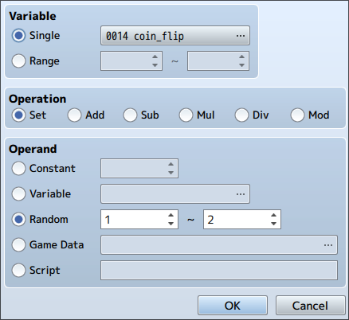

# Tails Never Fails

This mod removes the random-aspect of the coin toss in Fear & Hunger and forces it to always land on tails.

## Installation

Download the [`erri120_TailsNeverFails.js`](./erri120_TailsNeverFails.js) file and move it into the `www/js/plugins` folder. Update `www/js/plugins.js` to include the following at the end:

```javascript
,{"name":"erri120_TailsNeverFails","status":true,"description":""}
```

**NOTE:** The comma at the start is important!

## Technical Details

Coin flips are done using the "Control Variables" operation:



If you open the map files in an editor, you can search for these parameters:

```javascript
[
    14, // variable "coin_flip"
    14, // variable "coin_flip"
    0,  // SET the variable
    2,  // set the variable to a RANDOM value
    1,  // HEADS
    2   // TAILS
]
```

To force the coin toss to always land on tails, we can simply set the `coin_flip` variable to a constant value:

```javascript
[
    14, // variable "coin_flip"
    14, // variable "coin_flip"
    0,  // SET the variable
    0,  // use a CONSTANT value
    2   // TAILS
];
```

Replacing the parameters dynamically is done via a JavaScript plugin. You can find the source in [`erri120_TailsNeverFails.js`](./erri120_TailsNeverFails.js).

