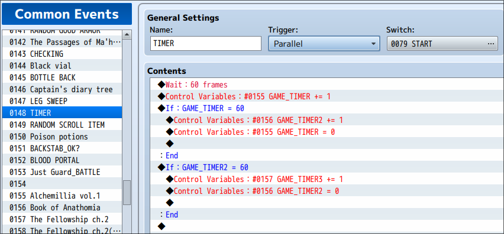

# Unlocked FPS

Fixes issues related to time and FPS.

## Installation

TODO

## Technical Details

RPG Maker MV/MZ uses the amount of rendered frames to calculate time ellapsed. You can read more
about this on my blog post [Dont' count frames to calculate time](https://erri120.github.io/posts/2021-09-29/).
In essence, RPG Maker MV/MZ assume that the game is always running at 60 FPS and that frame rendering
is consistend. However, the real world looks very different.

### Playtime

Playtime is calculated as follows:

```javascript
Game_System.prototype.playtime = function() {
    return Math.floor(Graphics.frameCount / 60);
};

Game_System.prototype.playtimeText = function() {
    var hour = Math.floor(this.playtime() / 60 / 60);
    var min = Math.floor(this.playtime() / 60) % 60;
    var sec = this.playtime() % 60;
    return hour.padZero(2) + ':' + min.padZero(2) + ':' + sec.padZero(2);
};
```

The function `Game_System.prototype.playtime` returns the playtime in seconds by dividing the amount
of rendered frames by `60`. The function `Game_System.prototype.playtimeText` is called by the saves
menu to display the current playtime for that particular save.

Fixing this is done by simply using dates instead of frames. See [`erri120_UnlockedFPS.js`](./erri120_UnlockedFPS.js)
for the details.

### Game Timer Fix

The game has a timer that also uses frame counts. Similar with playtime, the timer
is also broken when you run the game at something other than locked 60 FPS.

If you run the game at 144 FPS, the timer will ellapse x2.4 times faster. If you play at 30 FPS,
the timer will take twice as long.

Fear & Hunger uses a Common Event for the timer:



